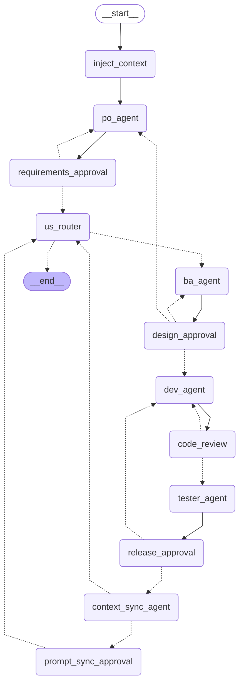

# Lưu đồ hoạt động của đội AI Dev Team

Sơ đồ này được sinh ra tự động từ code `src/dev-team/graph.ts`.

```mermaid
%%{init: {'flowchart': {'curve': 'linear'}}}%%
graph TD;
	__start__([<p>__start__</p>]):::first
	inject_context(inject_context)
	po_agent(po_agent)
	us_router(us_router)
	ba_agent(ba_agent)
	dev_agent(dev_agent)
	tester_agent(tester_agent)
	context_sync_agent(context_sync_agent)
	requirements_approval(requirements_approval)
	design_approval(design_approval)
	code_review(code_review)
	release_approval(release_approval)
	prompt_sync_approval(prompt_sync_approval)
	__end__([<p>__end__</p>]):::last
	__start__ --> inject_context;
	ba_agent --> design_approval;
	dev_agent --> code_review;
	inject_context --> po_agent;
	po_agent --> requirements_approval;
	tester_agent --> release_approval;
	requirements_approval -.-> po_agent;
	requirements_approval -.-> us_router;
	us_router -.-> ba_agent;
	us_router -.-> __end__;
	design_approval -.-> ba_agent;
	design_approval -.-> dev_agent;
	design_approval -.-> po_agent;
	code_review -.-> dev_agent;
	code_review -.-> tester_agent;
	release_approval -.-> dev_agent;
	release_approval -.-> context_sync_agent;
	context_sync_agent -.-> prompt_sync_approval;
	context_sync_agent -.-> us_router;
	prompt_sync_approval -.-> us_router;
	classDef default fill:#f2f0ff,line-height:1.2;
	classDef first fill-opacity:0;
	classDef last fill:#bfb6fc;

```