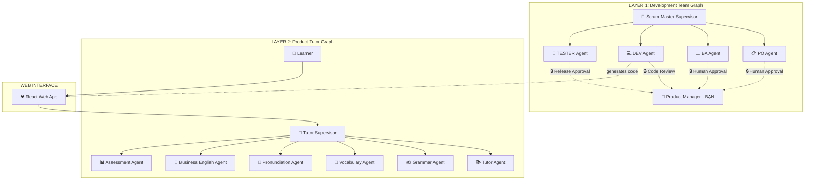
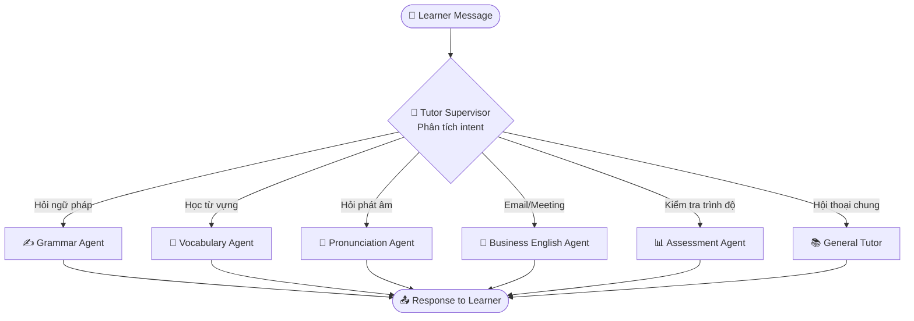

# EnglishPro AI - Implementation Plan (v2)

## Tổng quan

Xây dựng **EnglishPro AI** - nền tảng học tiếng Anh cho người đi làm với **2 lớp agentic AI**:

1. **🏗️ Development Team Graph** — Đội ngũ AI phát triển sản phẩm (PO, BA, DEV, TESTER) phối hợp quy trình Agile, có human-in-the-loop tại các bước quan trọng
2. **🎓 Tutor Graph** — Đội ngũ gia sư AI trên web (Tutor, Grammar, Vocabulary, Business English...) phục vụ người học

Cả 2 đều xây dựng trên **LangGraph JS** với kiến trúc **Supervisor + Hierarchical Multi-Agent**.

---

## Kiến trúc tổng thể



---

## Layer 1: Development Team Graph (Chi tiết)

### Workflow phát triển sản phẩm

```mermaid
flowchart LR
    Start([📝 Feature Request]) --> PO
    
    PO[PO Agent<br/>Viết User Stories<br/>& Acceptance Criteria]
    PO -->|"🔒 INTERRUPT"| HumanApprove1{👤 Bạn duyệt<br/>Requirements?}
    HumanApprove1 -->|Approve| BA
    HumanApprove1 -->|Reject + Feedback| PO
    
    BA[BA Agent<br/>Phân tích nghiệp vụ<br/>& Thiết kế giải pháp]
    BA -->|"🔒 INTERRUPT"| HumanApprove2{👤 Bạn duyệt<br/>Design?}
    HumanApprove2 -->|Approve| DEV
    HumanApprove2 -->|Reject + Feedback| BA
    
    DEV[DEV Agent<br/>Viết code<br/>& Unit tests]
    DEV -->|"🔒 INTERRUPT"| HumanReview{👤 Bạn review<br/>Code?}
    HumanReview -->|Approve| TESTER
    HumanReview -->|Request Changes| DEV
    
    TESTER[TESTER Agent<br/>Test cases<br/>& Bug reports]
    TESTER -->|Pass| HumanRelease{👤 Bạn duyệt<br/>Release?}
    TESTER -->|Fail| DEV
    HumanRelease -->|Release| Done([✅ Feature Done])
    HumanRelease -->|Hold| TESTER
```



### Mô tả chi tiết từng Agent trong Dev Team

| Agent | Vai trò | Input | Output | Tools |
|-------|---------|-------|--------|-------|
| **Scrum Master** | Supervisor - điều phối workflow | Feature request từ bạn | Route đến agent phù hợp | Agent routing, state tracking |
| **PO Agent** | Tạo Product Backlog | Feature idea, business context | User Stories, Acceptance Criteria, Priority | Template generator, backlog formatter |
| **BA Agent** | Phân tích & thiết kế | User Stories đã duyệt | Technical design, API specs, Data models, Wireframe mô tả | Design doc generator, diagram tool |
| **DEV Agent** | Implement code | Design docs đã duyệt | Source code, unit tests, PR summary | Code generator, file writer, test runner |
| **TESTER Agent** | Kiểm thử | Code + Acceptance Criteria | Test cases, test results, bug reports | Test case generator, test runner, reporter |

### Human-in-the-Loop Gates (sử dụng LangGraph `interrupt()`)

```typescript
// Ví dụ: PO Agent node với interrupt
const poAgentNode = async (state: DevTeamState) => {
  const userStories = await poAgent.invoke(state.messages);
  
  // 🔒 Dừng tại đây, chờ bạn duyệt
  const approval = interrupt({
    type: "requirements_review",
    content: userStories,
    question: "Bạn có đồng ý với requirements này không?"
  });
  
  if (approval.action === "reject") {
    // Chạy lại PO Agent với feedback
    return { messages: [...state.messages, approval.feedback] };
  }
  return { approvedRequirements: userStories };
};
```

---

## Layer 2: Tutor Graph (Chi tiết)

### Workflow hội thoại học tập



### Mô tả chi tiết từng Tutor Agent

| Agent | Vai trò chi tiết | Ví dụ tương tác |
|-------|------------------|-----------------|
| **Tutor Supervisor** | Phân tích intent, route đến agent phù hợp, duy trì context xuyên suốt | *"Tôi muốn học viết email"* → route đến Business Agent |
| **General Tutor** | Hội thoại tự do, giải thích concepts, đề xuất bài học | *"Present Perfect dùng khi nào?"* → giải thích + ví dụ |
| **Grammar Agent** | Phân tích lỗi, giảng dạy quy tắc, tạo bài tập | *"Check: I go to school yesterday"* → sửa + giải thích |
| **Vocabulary Agent** | Dạy từ vựng theo ngành, spaced repetition, collocations | *"Từ vựng IT thường dùng?"* → danh sách + ví dụ context |
| **Pronunciation Agent** | IPA guide, Anh-Mỹ vs Anh-Anh, tips cho người Việt | *"Phát âm 'schedule'?"* → /ˈʃedʒ.uːl/ vs /ˈskedʒ.uːl/ |
| **Business English Agent** | Email templates, meeting phrases, presentation skills | *"Viết email xin nghỉ phép"* → template + giải thích |
| **Assessment Agent** | Placement test, quiz theo level, progress tracking | *"Test trình độ"* → 20 câu hỏi → đánh giá CEFR level |

---

## Tech Stack

| Layer | Technology |
|-------|-----------|
| **Runtime** | Node.js 20+ / TypeScript |
| **Agent Framework** | `@langchain/langgraph` + `@langchain/core` |
| **LLM** | `@langchain/openai` hoặc `@langchain/google-genai` |
| **API** | Express.js + Server-Sent Events (streaming) |
| **Frontend** | React + Vite |
| **State** | LangGraph `MemorySaver` (dev) → PostgreSQL checkpointer (prod) |
| **Tracing** | LangSmith (optional) |

---

## Cấu trúc dự án

```
celestial-flare/
├── package.json
├── tsconfig.json
├── .env.example
├── implementation_plan.md
│
├── src/
│   ├── index.ts                          # Express server entry
│   ├── config/
│   │   └── env.ts                        # Environment config
│   │
│   ├── dev-team/                         # 🏗️ LAYER 1: Dev Team
│   │   ├── graph.ts                      # Dev Team supervisor graph
│   │   ├── state.ts                      # Dev Team state definition
│   │   ├── agents/
│   │   │   ├── po.agent.ts              # Product Owner agent
│   │   │   ├── ba.agent.ts              # Business Analyst agent
│   │   │   ├── dev.agent.ts             # Developer agent
│   │   │   └── tester.agent.ts          # Tester agent
│   │   ├── prompts/
│   │   │   ├── dev-team.prompts.ts
│   │   └── utils/
│   │       └── helpers.ts
│   │
│   ├── tutor/                            # 🎓 LAYER 2: Tutor Team
│   │   ├── graph.ts                      # Tutor supervisor graph
│   │   ├── state.ts                      # Tutor state definition
│   │   ├── agents/
│   │   │   ├── tutor.agent.ts
│   │   │   ├── grammar.agent.ts
│   │   │   ├── vocabulary.agent.ts
│   │   │   ├── pronunciation.agent.ts
│   │   │   ├── business.agent.ts
│   │   │   └── assessment.agent.ts
│   │   ├── prompts/
│   │   │   └── tutor.prompts.ts
│   │
│   ├── api/
│   │   ├── chat.routes.ts               # Tutor chat endpoints
│   │   ├── dev-team.routes.ts           # Dev team endpoints
│   │   └── middleware.ts
│   │
│   └── utils/
│       ├── logger.ts
│       └── helpers.ts
│
├── frontend/                             # 🌐 React Web App
│   ├── package.json
│   ├── src/
│   │   ├── App.tsx
│   │   ├── main.tsx
│   │   └── index.css
│   └── vite.config.ts
│
└── tests/
    ├── dev-team/
    │   └── workflow.test.ts
    └── tutor/
        └── routing.test.ts
```

---

## Kế hoạch triển khai theo Phase

### Phase 1 → Foundation & Dev Team Graph (Done)
### Phase 2 → Tutor Graph (Done)
### Phase 3 → Web Frontend (Done)
### Phase 4 → Integration & Verification (Done)

---

## Verification Plan

### Automated Tests
```bash
# Backend Check
npx tsc --noEmit

# Frontend Build
cd frontend && npm run build
```

### Manual Verification
1. **Dev Team**: Gửi feature request → verify PO tạo stories → approve → BA tạo design → approve → DEV code → review → TESTER test
2. **Tutor**: Chat các loại câu hỏi → verify routing đúng agent → verify response chất lượng
3. **Web**: Test UI trên browser, responsive, dark mode
