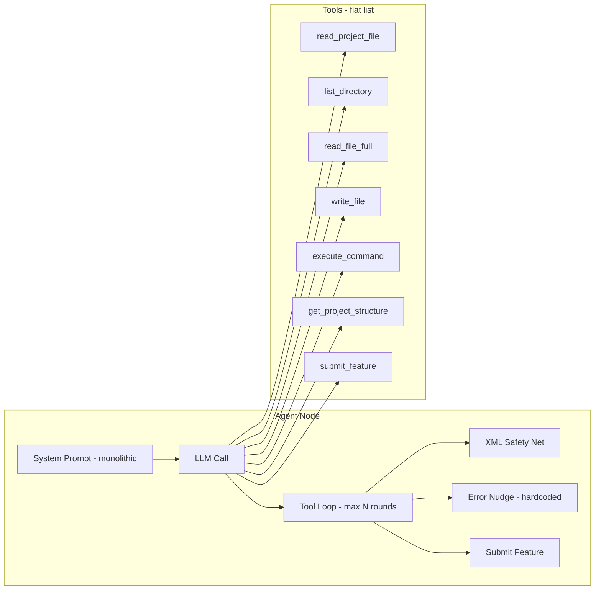
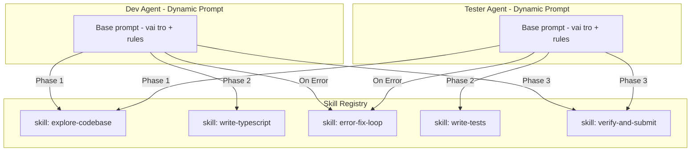
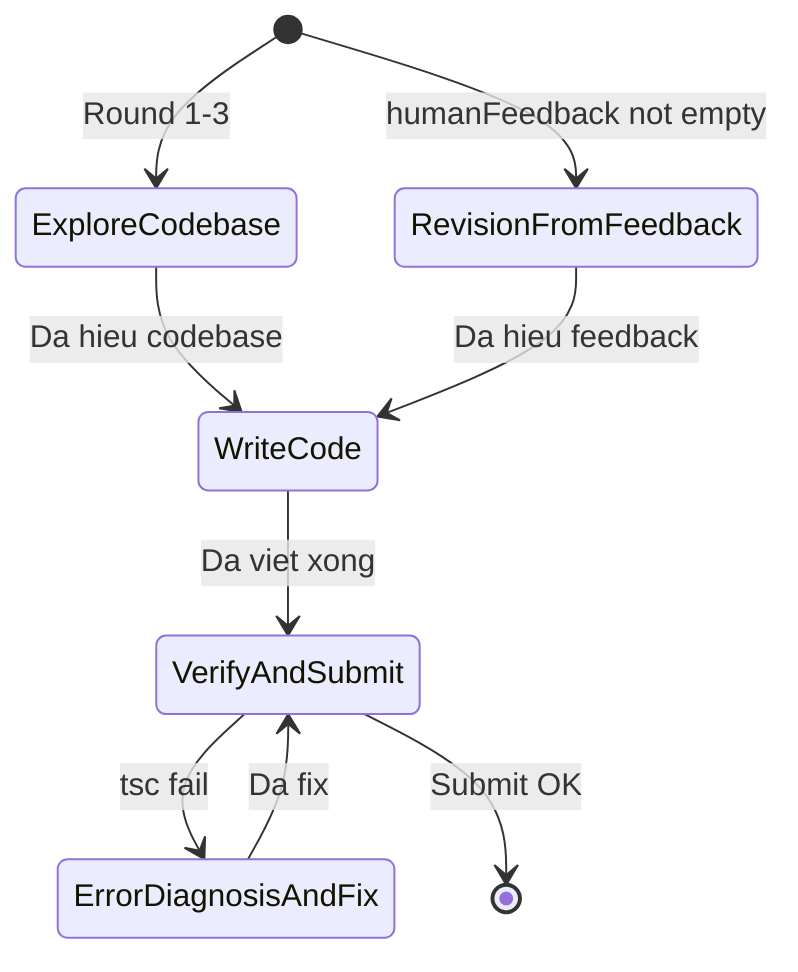

# Phân tích: Có nên xây dựng Skill System cho các Agent?

## TL;DR

**CÓ NÊN** xây dựng skill system, đặc biệt cho **Dev Agent** và **Tester Agent**. Lý do chính: hiện tại toàn bộ "kiến thức" của agent nằm trong **một prompt monolithic duy nhất** + **hardcoded logic** trong agent loop. Khi hệ thống phát triển, approach này gặp giới hạn nghiêm trọng về maintainability, token budget, và khả năng tái sử dụng.

---

## 1. Hiện trạng hệ thống

### 1.1. Kiến trúc agent hiện tại



### 1.2. Vấn đề cụ thể của từng agent

| Agent | File | Prompt size | Tool rounds | Đặc điểm |
|-------|------|-------------|-------------|-----------|
| **PO** | `po.agent.ts` | ~2K chars | 5 | Đơn giản, ít tool. Prompt OK |
| **BA** | `ba.agent.ts` | ~2K chars | 5 | Đơn giản, ít tool. Prompt OK |
| **DEV** | `dev.agent.ts` | ~5K chars | 15 | **Phức tạp nhất**. Prompt dài, nhiều quy trình lồng nhau |
| **Tester** | `tester.agent.ts` | ~7K chars | 18 | **Prompt dài nhất**. Nhiều guidelines + error handling |
| **Context Sync** | `context-sync.agent.ts` | ~1K chars | 0 | Deterministic, không cần skill |

### 1.3. Pain points đã quan sát từ debug logs

Từ `debug-logs/dev-round-*.json`:

| Round | Hành vi | Vấn đề |
|-------|---------|--------|
| 1-4 | Đọc codebase | OK — khám phá dự án |
| 5-9 | Write files | OK — viết code |
| 10 | tsc → lỗi → rewrite toàn bộ file agent | **Không có chiến lược fix cụ thể** |
| 11-13 | Fix lỗi → retry | Tốn nhiều round cho error fix loop |
| 14 | Submit | OK nhưng đã gần hết budget 15 rounds |

**Vấn đề cốt lõi:** Dev Agent cố gắng làm quá nhiều thứ trong MỘT system prompt:
- Hiểu codebase conventions
- Biết cách viết TypeScript theo project patterns
- Biết error handling workflow khi tsc fail
- Biết phân biệt lỗi pre-existing vs lỗi tự gây ra
- Biết khi nào nên submit vs retry

---

## 2. Skill System là gì trong ngữ cảnh này?

**Skill = một đơn vị kiến thức + quy trình có thể inject động vào agent prompt.**

Thay vì nhồi tất cả vào system prompt, skill system cho phép:



### 2.1. Cấu trúc một Skill

```typescript
interface AgentSkill {
  name: string;                    // "error-fix-loop"
  description: string;             // Mô tả ngắn
  triggerCondition?: string;       // Khi nào nên kích hoạt
  promptFragment: string;          // Đoạn prompt inject vào system message
  requiredTools?: string[];        // Tools cần thiết cho skill này
  examples?: string[];             // Few-shot examples
}
```

---

## 3. Phân tích lợi/hại

### 3.1. Lợi ích

| # | Lợi ích | Giải thích | Ảnh hưởng |
|---|---------|------------|-----------|
| 1 | **Giảm prompt size** | Chỉ inject skill cần thiết tại thời điểm cần → tiết kiệm token budget | Cao |
| 2 | **Tái sử dụng cross-agent** | `explore-codebase` và `error-fix-loop` dùng chung cho Dev + Tester | Cao |
| 3 | **Dễ iterate** | Sửa skill "error-fix-loop" 1 chỗ → cả Dev + Tester đều được cải thiện | Cao |
| 4 | **Phase-aware prompting** | Inject "write-typescript" khi đang code, "error-fix-loop" khi gặp lỗi → LLM focus hơn | Trung bình |
| 5 | **Testable** | Có thể test từng skill độc lập (prompt + expected behavior) | Trung bình |
| 6 | **Extensible** | Thêm skill mới không cần sửa agent code, chỉ đăng ký vào registry | Trung bình |

### 3.2. Chi phí / Rủi ro

| # | Rủi ro | Giải thích | Mức độ |
|---|--------|------------|--------|
| 1 | **Over-engineering** | PO và BA agent đơn giản, không cần skill system | Thấp — chỉ áp dụng cho Dev + Tester |
| 2 | **Complexity tăng** | Thêm abstraction layer → khó debug hơn | Trung bình — cần logging tốt |
| 3 | **Prompt coherence** | Ghép nhiều skill fragments có thể mâu thuẫn | Trung bình — cần review |
| 4 | **Migration effort** | Phải refactor prompt + agent loop hiện tại | Trung bình |

### 3.3. So sánh: Monolithic Prompt vs Skill System

| Tiêu chí | Monolithic hiện tại | Skill System |
|-----------|---------------------|-------------|
| Token efficiency | ❌ Gửi toàn bộ mọi lần | ✅ Chỉ gửi skill cần thiết |
| Cross-agent reuse | ❌ Copy-paste giữa agents | ✅ Shared skill registry |
| Maintainability | ❌ Sửa 1 chỗ phải sửa N agents | ✅ Sửa 1 skill → N agents |
| Debugging | ✅ Đơn giản, 1 file | ⚠️ Phải trace skill nào active |
| LLM focus | ❌ Nhiều instructions → dễ miss | ✅ Context nhỏ → focus hơn |
| Setup effort | ✅ Zero | ⚠️ Cần build registry + loader |

---

## 4. Đề xuất Skills cho Dev Agent

Dựa trên phân tích debug logs và code hiện tại, Dev Agent cần **5 skills chính**:

### Skill 1: `explore-codebase`
- **Khi nào:** Round 1-3, khi bắt đầu nhiệm vụ mới
- **Nội dung:** Hướng dẫn dùng `get_project_structure`, `list_directory`, `read_project_file` để hiểu conventions
- **Reuse:** Dev + Tester + BA đều dùng

### Skill 2: `write-typescript-code`
- **Khi nào:** Sau khi đã hiểu codebase
- **Nội dung:** Coding conventions (ESM, strict mode, .js extension, named exports), patterns trong project (tool definition, agent loop, state management)
- **Reuse:** Dev only

### Skill 3: `error-diagnosis-and-fix`
- **Khi nào:** Khi `execute_command` trả về lỗi (tsc, build fail)
- **Nội dung:** Parse error output → xác định file/line → phân loại pre-existing vs self-caused → read → fix → re-verify
- **Reuse:** Dev + Tester
- **Đây là skill quan trọng nhất** — hiện tại hardcoded trong error nudge message

### Skill 4: `verify-and-submit`
- **Khi nào:** Khi đã viết xong code
- **Nội dung:** Chạy tsc → fix nếu cần → submit_feature với report format chuẩn
- **Reuse:** Dev + Tester (format khác nhau)

### Skill 5: `revision-from-feedback`
- **Khi nào:** `humanFeedback` không rỗng hoặc có `testResults` fail
- **Nội dung:** Đọc feedback → đọc code cũ → xác định scope thay đổi → fix → verify
- **Reuse:** Dev only

### Mermaid: Skill activation flow cho Dev Agent



---

## 5. Đề xuất kiến trúc implementation

### 5.1. File structure

```
src/dev-team/
├── skills/
│   ├── index.ts                    # Skill registry + loader
│   ├── types.ts                    # AgentSkill interface
│   ├── explore-codebase.skill.ts   # Shared: Dev + Tester + BA
│   ├── write-typescript.skill.ts   # Dev only
│   ├── error-fix-loop.skill.ts     # Shared: Dev + Tester
│   ├── verify-submit.skill.ts      # Shared: Dev + Tester
│   ├── revision-feedback.skill.ts  # Dev only
│   └── write-tests.skill.ts        # Tester only
├── agents/
│   ├── dev.agent.ts                # Refactored to use skills
│   └── tester.agent.ts             # Refactored to use skills
```

### 5.2. Skill Registry

```typescript
// src/dev-team/skills/index.ts
class SkillRegistry {
  private skills: Map<string, AgentSkill>;
  
  register(skill: AgentSkill): void;
  get(name: string): AgentSkill | undefined;
  
  // Build dynamic prompt based on current context
  buildPrompt(params: {
    basePrompt: string;
    activeSkills: string[];
    context: Record<string, unknown>;
  }): string;
  
  // Auto-select skills based on agent state
  selectSkills(params: {
    agentRole: "dev" | "tester";
    currentRound: number;
    hasError: boolean;
    hasFeedback: boolean;
  }): string[];
}
```

### 5.3. Integration vào Dev Agent

```typescript
// Simplified dev agent with skills
for (let round = 0; round < MAX_ROUNDS; round++) {
  // Dynamic skill selection based on current state
  const activeSkills = skillRegistry.selectSkills({
    agentRole: "dev",
    currentRound: round,
    hasError: lastRoundHadError,
    hasFeedback: !!humanFeedback,
  });
  
  // Rebuild system prompt with only relevant skills
  const dynamicPrompt = skillRegistry.buildPrompt({
    basePrompt: DEV_BASE_PROMPT,  // Shorter base prompt
    activeSkills,
    context: { writtenFiles, projectContext },
  });
  
  // Update system message
  messages[0] = new SystemMessage(dynamicPrompt);
  
  const response = await llm.invoke(messages);
  // ... tool execution ...
}
```

---

## 6. Phân tích impact cho từng agent

| Agent | Cần Skill System? | Lý do | Priority |
|-------|-------------------|-------|----------|
| **Dev Agent** | ✅ **CÓ** | Prompt phức tạp nhất, nhiều phase, error handling phức tạp, 15 rounds | **P0 — Cao nhất** |
| **Tester Agent** | ✅ **CÓ** | Prompt dài nhất, nhiều guidelines, share skills với Dev | **P1 — Cao** |
| **PO Agent** | ❌ Không | Prompt đơn giản, ít logic, 5 rounds đủ | N/A |
| **BA Agent** | ❌ Không | Tương tự PO, read-only tools | N/A |
| **Context Sync** | ❌ Không | Deterministic logic, không dùng LLM loop | N/A |

---

## 7. Kế hoạch triển khai (nếu đồng ý)

### Phase 1: Foundation
- [ ] Tạo `src/dev-team/skills/types.ts` — định nghĩa `AgentSkill` interface
- [ ] Tạo `src/dev-team/skills/index.ts` — `SkillRegistry` class với `register()`, `buildPrompt()`, `selectSkills()`
- [ ] Viết unit tests cho SkillRegistry

### Phase 2: Extract Skills từ Dev Agent
- [ ] Extract `explore-codebase` skill từ `DEV_PROMPT` section "Bước 1: Khám phá codebase"
- [ ] Extract `write-typescript` skill từ `DEV_PROMPT` section "Quy tắc coding"
- [ ] Extract `error-fix-loop` skill từ `DEV_PROMPT` section "QUY TRÌNH XỬ LÝ LỖI" + error nudge logic trong `dev.agent.ts`
- [ ] Extract `verify-submit` skill từ `DEV_PROMPT` section "Bước 3-4"
- [ ] Extract `revision-feedback` skill từ logic xử lý `humanFeedback` trong `dev.agent.ts`

### Phase 3: Refactor Dev Agent
- [ ] Tách `DEV_PROMPT` thành `DEV_BASE_PROMPT` (ngắn gọn, chỉ vai trò + tools available)
- [ ] Refactor `devAgentNode()` để dùng `SkillRegistry.selectSkills()` + `buildPrompt()`
- [ ] Giữ nguyên error nudge nhưng delegate content cho `error-fix-loop` skill
- [ ] Test end-to-end: chạy workflow với skill system

### Phase 4: Refactor Tester Agent
- [ ] Reuse `explore-codebase` và `error-fix-loop` skills
- [ ] Tạo `write-tests` skill đặc thù cho Tester
- [ ] Refactor `testerAgentNode()` tương tự Dev

### Phase 5: Optimize & Monitor
- [ ] Thêm logging: skill nào được activate ở round nào
- [ ] So sánh token usage trước/sau
- [ ] So sánh số rounds cần thiết trước/sau
- [ ] Fine-tune skill selection logic dựa trên kết quả thực tế

---

## 8. Kết luận

**Khuyến nghị: NÊN xây dựng skill system**, tập trung vào **Dev Agent trước** (P0), sau đó mở rộng sang **Tester Agent** (P1). Lý do:

1. **Dev Agent là bottleneck chính** — 14/15 rounds, prompt phức tạp nhất, error handling logic bị hardcoded
2. **Code duplication cao** — Dev và Tester share ~60% logic (explore codebase, error fix, verify) nhưng hiện copy-paste
3. **Token budget bị lãng phí** — Gửi toàn bộ prompt (bao gồm error handling instructions) ngay cả khi chưa gặp lỗi
4. **Skill system mở đường** cho tính năng nâng cao: adaptive prompting (thay đổi strategy dựa trên devAttempts), A/B test skill variants, và plugin-style extensibility

PO, BA, Context Sync Agent **KHÔNG CẦN** skill system — prompt đủ đơn giản và stable.
