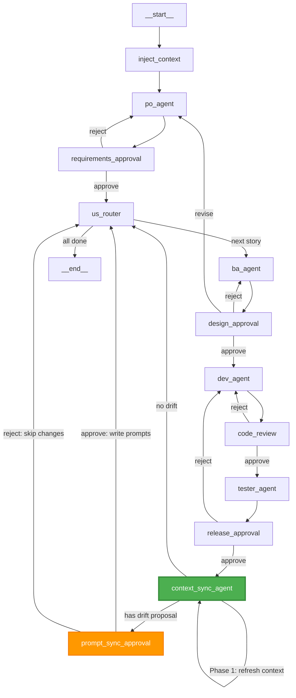

# Plan: Context Sync Agent — Hybrid Approach

## Vấn đề
Hệ thống AI agent hiện tại bị **stale context** sau khi code thay đổi:

1. **`projectContext`** — Scan cấu trúc dự án 1 lần duy nhất khi build graph, không bao giờ refresh
2. **`WORKFLOW_CONTEXT` trong prompts** — Hardcoded, mô tả sai lệch so với code thực tế (thiếu `us_router`, thiếu state fields mới...)
3. **Inter-sprint context decay** — Sprint N+1 không biết sprint N đã tạo file gì

## Giải pháp: Hybrid Context Sync Agent

### Nguyên tắc
- **Deterministic** cho `projectContext`: regenerate bằng code (không dùng LLM)
- **AI-powered** cho prompt drift detection: dùng LLM đánh giá và đề xuất sửa prompts
- **Human approval** bắt buộc khi sửa prompt files; không cần approval cho context refresh

---

## Kiến trúc

### Flow mới trong Graph

```
release_approval ──(approve)──→ context_sync_agent ──→ prompt_sync_approval (nếu có thay đổi prompt)
                                      │                         │
                                      │                    ┌────┴────┐
                                      │                 approve   reject
                                      │                    │        │
                                      ▼                    ▼        ▼
                                  us_router ◄──────────────┘   us_router (bỏ qua thay đổi prompt)
```

### Hai phase hoạt động

**Phase 1 — Deterministic Context Refresh (luôn chạy, không cần LLM)**
- Gọi lại `generateProjectContext()` để re-scan `src/` structure
- Cập nhật `state.projectContext` với snapshot mới
- Tạo change summary: so sánh projectContext cũ vs mới, liệt kê files added/removed

**Phase 2 — AI Prompt Drift Detection (chỉ chạy khi phát hiện thay đổi đáng kể)**
- Đọc `dev-team.prompts.ts` hiện tại
- Đọc `state.ts` và `graph.ts` hiện tại
- So sánh: prompts có mô tả đúng state fields, graph flow, tools không?
- Nếu phát hiện drift → đề xuất thay đổi → `interrupt()` để PM duyệt
- Nếu PM approve → dùng `write_file` để cập nhật prompts
- Nếu PM reject hoặc không có drift → bỏ qua, tiếp tục flow

---

## Chi tiết Implementation

### 1. Thêm state fields mới trong `state.ts`

```typescript
/** Tóm tắt thay đổi từ sprint vừa hoàn thành */
contextSyncSummary: Annotation<string>({
  reducer: (_, next) => next,
  default: () => "",
}),

/** Đề xuất thay đổi prompt từ Context Sync Agent (nếu có) */
promptChangeProposal: Annotation<string>({
  reducer: (_, next) => next,
  default: () => "",
}),
```

### 2. Tạo file `src/dev-team/agents/context-sync.agent.ts`

```typescript
// Phase 1: Deterministic
function refreshProjectContext(oldContext: string): {
  newContext: string;
  changeSummary: string;
  hasSignificantChanges: boolean;
}

// Phase 2: AI-powered (chỉ khi hasSignificantChanges = true)
async function detectPromptDrift(state: DevTeamStateType): Promise<{
  hasDrift: boolean;
  proposal: string; // markdown mô tả thay đổi đề xuất
}>
```

**Trigger logic cho Phase 2:**
- So sánh `oldContext` vs `newContext`: nếu có file mới trong `src/dev-team/` → khả năng cao cần update prompts
- Nếu `sourceCode` (báo cáo Dev) có nhắc đến thay đổi state, graph, tools → trigger Phase 2
- Nếu không có dấu hiệu thay đổi workflow → skip Phase 2 (tiết kiệm API cost)

### 3. Tạo file `src/dev-team/prompts/context-sync.prompts.ts`

System prompt cho Context Sync Agent khi chạy Phase 2:
- Input: current prompts file content + current state.ts + current graph.ts + change summary
- Output: đề xuất chỉnh sửa cụ thể (file nào, section nào, sửa gì)

### 4. Thêm approval gate `prompt_sync_approval` trong `graph.ts`

- Chỉ kích hoạt khi Phase 2 phát hiện drift và có đề xuất
- Hiển thị đề xuất cho PM: "Agent đề xuất sửa WORKFLOW_CONTEXT vì phát hiện X, Y, Z"
- PM approve → agent dùng `write_file` để cập nhật
- PM reject → bỏ qua, log warning

### 5. Sửa `graph.ts` — Thêm node và edges mới

```
// Thay đổi: release_approval không còn trỏ thẳng về us_router
// Mà đi qua context_sync_agent trước

release_approval ──(approve)──→ context_sync_agent
release_approval ──(reject)───→ dev_agent

context_sync_agent ──(no drift)───→ us_router
context_sync_agent ──(has drift)──→ prompt_sync_approval

prompt_sync_approval ──(approve/reject)──→ us_router
```

### 6. Sửa `releaseApproval()` trong `graph.ts`

Thay `nextAgent: "us_router"` thành `nextAgent: "context_sync_agent"`.

### 7. Sửa `usRouterNode()` trong `graph.ts`

Không cần thay đổi logic. `us_router` vẫn nhận `projectContext` mới từ state (đã được Context Sync Agent cập nhật).

---

## Files cần tạo/sửa

| File | Action | Mô tả |
|------|--------|-------|
| `src/dev-team/agents/context-sync.agent.ts` | **Tạo mới** | Context Sync Agent - Phase 1 (deterministic) + Phase 2 (AI drift detection) |
| `src/dev-team/prompts/context-sync.prompts.ts` | **Tạo mới** | System prompt cho Phase 2 AI drift detection |
| `src/dev-team/state.ts` | **Sửa** | Thêm `contextSyncSummary` và `promptChangeProposal` |
| `src/dev-team/graph.ts` | **Sửa** | Thêm `context_sync_agent` node, `prompt_sync_approval` gate, sửa edges |
| `src/dev-team/prompts/dev-team.prompts.ts` | **Sửa** | Cập nhật `WORKFLOW_CONTEXT` để phản ánh flow mới (có context_sync_agent) |
| `src/dev-team/project-context.ts` | **Sửa nhỏ** | Export thêm helper function cho diff comparison |

---

## Mermaid Diagram — Full Flow mới



---

## Rủi ro và Mitigation

| Rủi ro | Mức độ | Giải pháp |
|--------|--------|-----------|
| LLM sửa prompt sai, gây regression | Medium | Human approval bắt buộc + backup prompt trước khi sửa |
| Tốn thêm API cost mỗi sprint | Low | Phase 2 chỉ chạy khi có significant changes trong src/dev-team/ |
| Context Sync Agent bị stuck/crash | Low | Timeout + fallback: skip sync, tiếp tục us_router bình thường |
| Circular dependency nếu agent sửa chính graph.ts | Medium | Blacklist: agent KHÔNG ĐƯỢC sửa graph.ts, chỉ sửa prompts |

---

## Thứ tự triển khai

1. Thêm state fields mới (`contextSyncSummary`, `promptChangeProposal`)
2. Sửa `project-context.ts` — thêm diff helper
3. Tạo `context-sync.prompts.ts`
4. Tạo `context-sync.agent.ts` (Phase 1 + Phase 2)
5. Sửa `graph.ts` — thêm nodes, edges, approval gate
6. Cập nhật `WORKFLOW_CONTEXT` trong `dev-team.prompts.ts` để phản ánh flow mới
7. Test thủ công: chạy workflow, verify context được refresh sau mỗi sprint
