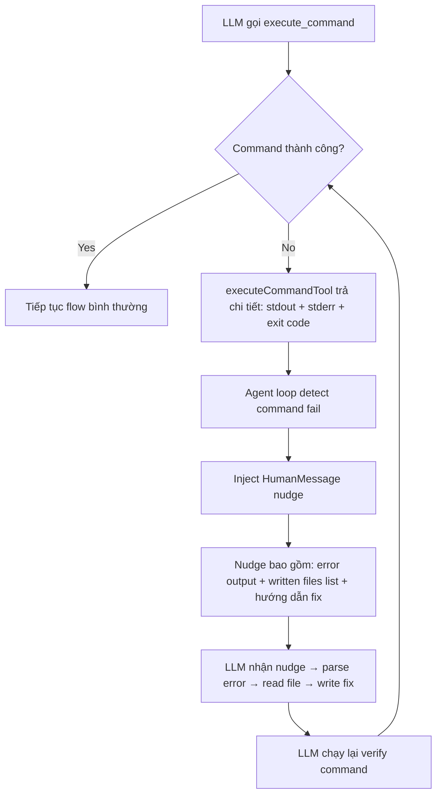

# Plan: DEV Agent tự đọc lỗi và sửa lỗi khi tool thất bại

## Vấn đề hiện tại

Khi DEV Agent chạy `execute_command` (vd: `tsc --noEmit`, `npm run build`) và nhận lỗi, nó **không tự phân tích lỗi để sửa**. Thay vào đó nó:
- Đọc thêm file (không liên quan)
- Retry cùng command (vẫn fail)  
- Hoặc chạy thêm command khác (npm test khi build còn chưa pass)
- Cuối cùng hết 12 vòng → thất bại

### Bằng chứng từ debug logs

| Round | Action | Kết quả |
|-------|--------|---------|
| 6 | `tsc --noEmit 2>&1` | ❌ Lỗi compile |
| 7 | `read_project_file` state.ts | Đọc file, không sửa |
| 8 | `npm run build` | ❌ Lỗi build (cùng nguyên nhân) |
| 9 | `npm test` | ❌ Fail (chưa build được thì test cũng fail) |
| 10 | `tsc --noEmit 2>&1 \|\| true` | ❌ Bị reject vì pipe operator |
| 11-12 | `read_file_full` | Đọc file test, không fix gì |

## Root Causes

### 1. `executeCommandTool` mất thông tin lỗi chi tiết
File: `src/dev-team/tools/execution-tools.ts` dòng 178-181

```typescript
// Hiện tại - chỉ lấy error.message (Node.js wrapper text)
const stderr = error instanceof Error ? error.message : String(error);
return `❌ Lệnh thất bại:\n${stderr}`;
```

Node.js `execSync` khi throw error có cả `error.stdout` và `error.stderr` nhưng code chỉ dùng `error.message` → mất output chi tiết từ tsc (file nào, dòng nào, lỗi gì).

### 2. Agent loop không nudge LLM khi phát hiện lỗi
File: `src/dev-team/agents/dev.agent.ts` dòng 365-379

Sau khi nhận tool result thất bại, không có message nào inject vào conversation để guide LLM: *"Bạn vừa gặp lỗi compilation. Hãy đọc output, xác định file/dòng lỗi, sửa bằng write_file, rồi verify lại."*

### 3. Không track file nào agent đã viết
Agent không biết file nào là do nó tạo/sửa → không phân biệt được "lỗi do mình gây ra" vs "lỗi pre-existing trong project".

### 4. Prompt thiếu quy trình xử lý lỗi cụ thể
`DEV_PROMPT` chỉ nói "Nếu có lỗi → sửa và chạy lại" nhưng không mô tả HOW.

---

## Giải pháp

### Fix 1: Cải thiện output từ `executeCommandTool`
**File:** `src/dev-team/tools/execution-tools.ts`

Thay vì chỉ lấy `error.message`, trích xuất `error.stdout` + `error.stderr` từ Node.js `execSync` error object. Cần cast error sang `ExecSyncError` type để access `.stdout`, `.stderr`, `.status`.

```
Trước: ❌ Lệnh thất bại:\nCommand failed: tsc --noEmit\n...
Sau:   ❌ Lệnh thất bại (exit code 2):\n[STDOUT]\nsrc/dev-team/state.ts(12,5): error TS2345: ...\n[STDERR]\n...
```

### Fix 2: Error-aware nudge trong agent loop
**Files:** `src/dev-team/agents/dev.agent.ts`, `src/dev-team/agents/tester.agent.ts`

Sau khi execute tool xong trong mỗi round, kiểm tra xem có `execute_command` nào fail không. Nếu có → inject thêm một `HumanMessage` vào conversation hướng dẫn LLM phải:
1. Đọc kỹ error output
2. Xác định file + dòng lỗi
3. Dùng `read_project_file` nếu cần xem context
4. Dùng `write_file` để sửa
5. Chạy lại command để verify

Chỉ nudge khi phát hiện pattern lỗi compilation/test (không nudge cho mọi tool error tránh spam).

### Fix 3: Track danh sách file đã write
**Files:** `src/dev-team/agents/dev.agent.ts`, `src/dev-team/agents/tester.agent.ts`

Maintain một `Set<string>` các file mà agent đã `write_file`. Khi gặp lỗi compilation, include thông tin này trong nudge message để LLM biết focus vào file nào.

### Fix 4: Bổ sung Error-Handling Workflow vào `DEV_PROMPT`
**File:** `src/dev-team/prompts/dev-team.prompts.ts`

Thêm section "Quy trình xử lý lỗi khi verify" vào prompt với các bước cụ thể:
- Parse error output → tìm file:line:error
- Nếu file nằm trong danh sách file mình đã viết → đọc file và sửa ngay
- Nếu file là pre-existing → ghi nhận vào report, không sửa
- Re-run verify command sau mỗi lần fix
- Tối đa 3 vòng fix, sau đó submit kèm danh sách remaining errors

### Fix 5 (minor): executeCommandTool whitelist cải thiện  
Cân nhắc cho phép `tsc --noEmit` chạy thành công hơn bằng cách handle exit code != 0 nhưng vẫn có output hữu ích (tsc trả exit code 2 khi có type errors nhưng stdout vẫn chứa danh sách errors). Hiện tại `execSync` throw error khi exit code != 0 khiến output bị wrap trong error message.

---

## Chi tiết thay đổi từng file

### 1. `src/dev-team/tools/execution-tools.ts` — executeCommandTool

**Thay đổi:** Cải thiện error handling trong catch block để trích xuất stdout/stderr chi tiết.

Cụ thể:
- Cast error thành type có `stdout`, `stderr`, `status` fields
- Kết hợp stdout + stderr thành output rõ ràng với labels
- Truncate nếu quá dài (giữ phần cuối vì lỗi summary thường ở cuối)

### 2. `src/dev-team/agents/dev.agent.ts` — Agent loop

**Thay đổi:**
- Thêm `Set<string> writtenFiles` để track file đã write
- Sau mỗi round xử lý tools xong, detect xem có `execute_command` fail không
- Nếu có fail → inject `HumanMessage` nudge với:
  - Error output
  - Danh sách file đã viết
  - Hướng dẫn cụ thể: parse error → read file → fix → re-verify
- Thêm logic phân biệt: nếu lỗi chỉ ở file pre-existing thì cho phép submit kèm ghi chú

### 3. `src/dev-team/agents/tester.agent.ts` — Agent loop  

**Thay đổi:** Tương tự dev.agent.ts — thêm nudge khi `execute_command` fail, track written files.

### 4. `src/dev-team/prompts/dev-team.prompts.ts` — DEV_PROMPT

**Thay đổi:** Thêm section mới trong prompt:

```
## QUY TRÌNH XỬ LÝ LỖI KHI VERIFY (BẮT BUỘC)

Khi chạy `tsc --noEmit` hoặc `npm run build` mà thấy lỗi:

1. ĐỌC KỸ error output — tìm pattern: `file(line,col): error TSxxxx: message`
2. XÁC ĐỊNH file lỗi thuộc nhóm nào:
   - File bạn vừa tạo/sửa → BẮT BUỘC FIX NGAY
   - File có sẵn (pre-existing) → GHI NHẬN, không cần sửa
3. Dùng `read_project_file` để đọc file lỗi nếu cần context
4. Dùng `write_file` để sửa lỗi
5. Chạy lại verify command
6. Lặp lại tối đa 3 lần. Nếu vẫn còn lỗi pre-existing → submit kèm ghi chú

TUYỆT ĐỐI KHÔNG:
- Bỏ qua lỗi compilation rồi submit
- Chạy npm test khi build còn chưa pass
- Retry cùng command mà không sửa gì
```

---

## Mermaid Diagram: Flow sau khi fix



## Ảnh hưởng

- **Không breaking change**: Chỉ thêm logic mới, không thay đổi interface/state
- **Backward compatible**: Nếu command thành công, mọi thứ hoạt động như cũ
- **Cả dev.agent.ts và tester.agent.ts** đều cần fix (cùng pattern)
- **Prompt thay đổi** chỉ là additive (thêm section, không xóa gì)
