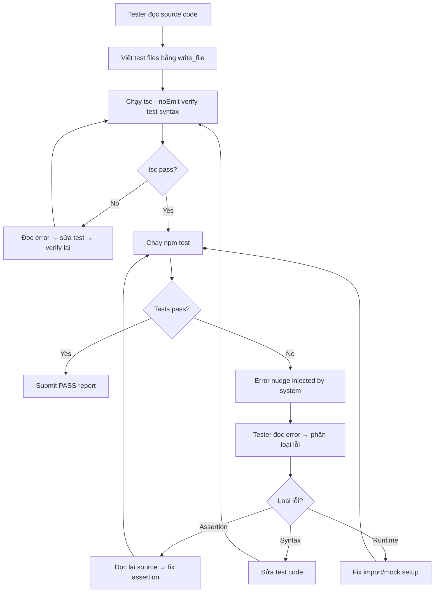

# Plan: Tester Agent — Viết test ít lỗi hơn & tự sửa khi test fail

## Vấn đề hiện tại

Tester Agent viết test files với nhiều lỗi:

### Lỗi syntax (round 11)
```
const { type DevTeamStateType } = {} as any; // INVALID JS SYNTAX
```
Tester không verify test file bằng `tsc --noEmit` trước khi chạy `npm test`.

### Lỗi logic (round 13) 
```
expect(result).toBeNull();    // Actual: undefined
expect(mockQuery).toHaveBeenCalledTimes(1);  // Actual: 0 times
```
Tester đoán return type/behavior thay vì đọc kỹ source code.

### Kết quả
- Round 10: Write test → syntax error
- Round 12: Fix syntax → 6 logic errors  
- Round 14: Attempt fix → chưa kịp run
- Round 15: Hết vòng → thất bại

## Root Causes

1. **Không verify test trước khi run** — viết xong test thì chạy npm test luôn, bỏ qua tsc check
2. **Không có error nudge** — giống vấn đề DEV agent vừa fix, khi npm test fail không có guide sửa
3. **LLM hallucination syntax** — viết code TypeScript invalid
4. **Mock assumptions sai** — không dựa vào actual function signatures
5. **Prompt thiếu "verify test" step** — Bước 3→4 nhảy thẳng từ write→run
6. **Prompt thiếu test writing guidelines** — không hướng dẫn cách viết test đúng

## Giải pháp

### Fix 1: Thêm error-aware nudge vào `tester.agent.ts`
Cùng pattern đã fix cho DEV agent:
- Track `writtenFiles` (Set)
- Sau mỗi round, detect `execute_command` fail
- Inject `HumanMessage` nudge hướng dẫn sửa test

### Fix 2: Bổ sung `TESTER_PROMPT` — quy trình viết test và xử lý lỗi

**2a. Thêm bước verify test giữa Bước 3 và Bước 4:**
- Sau khi viết test files bằng `write_file`
- BẮT BUỘC chạy `tsc --noEmit` để verify test file compile
- Nếu có syntax error → sửa ngay → verify lại
- Chỉ khi tsc pass → mới chạy `npm test`

**2b. Thêm quy trình xử lý lỗi khi test fail:**
- Đọc kỹ error output, phân biệt:
  - Syntax/compile error → sửa test code
  - Assertion error → đọc lại source code, fix mock/assertion
  - Runtime error → kiểm tra import paths, module resolution
- Tối đa 2 vòng sửa test, sau đó submit với kết quả hiện có

**2c. Thêm test writing guidelines:**
- LUÔN dùng actual function signatures từ source code đã đọc
- KHÔNG đoán return types — check source function body
- Prefer simple assertions trước, rồi mới adversarial
- Test imports phải dùng đúng module paths (.js extension cho ESM)
- Khi mock, verify mock structure khớp với actual DB layer

### Fix 3 (bonus): Thêm "tsc --noEmit" auto-step sau write_file test
Trong agent loop, sau khi detect Tester vừa `write_file` cho `*.test.ts`, có thể auto-inject reminder: "Bạn vừa viết test file. Hãy chạy `tsc --noEmit` để verify trước khi chạy `npm test`."

## Chi tiết thay đổi từng file

### 1. `src/dev-team/agents/tester.agent.ts`
- Thêm `writtenFiles` Set tracking
- Thêm error-aware nudge logic sau mỗi round (giống dev.agent.ts)
- Thêm "test file written" reminder khi detect write_file cho *.test.ts

### 2. `src/dev-team/prompts/dev-team.prompts.ts` — TESTER_PROMPT
- Sửa Bước 3: thêm sub-step verify test file compile
- Thêm Bước 3.5: Verify test files (tsc --noEmit)
- Thêm section: "QUY TRÌNH XỬ LÝ LỖI KHI TEST FAIL"
- Thêm section: "GUIDELINES VIẾT TEST ĐÚNG CÁCH"

## Flow sau khi fix


