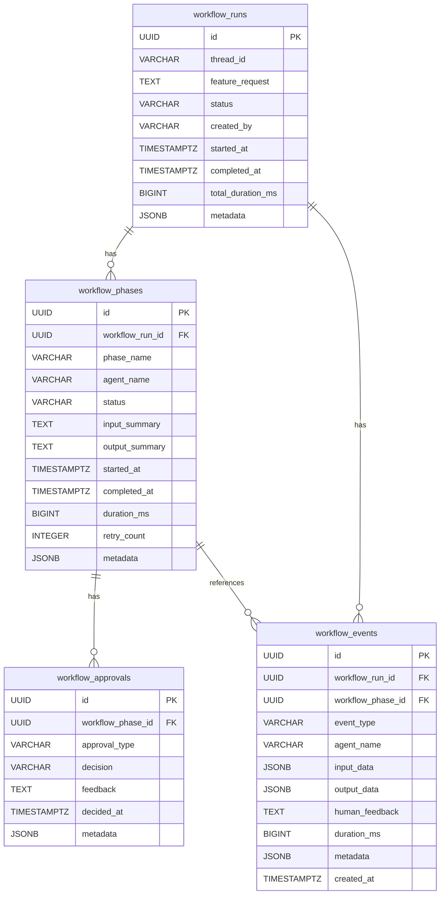
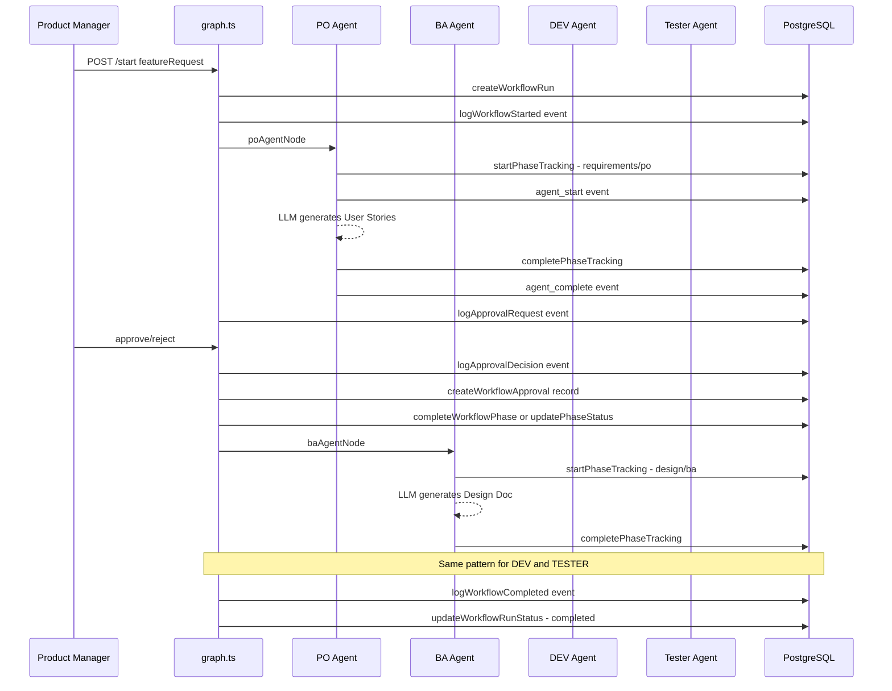

# 📊 Đánh Giá Tính Năng Workflow History Tracking

## Yêu Cầu Gốc
> Tự động ghi lại toàn bộ lịch sử và diễn biến làm việc của đội Dev Team (từ lúc giao yêu cầu đến khi Tester chạy test xong) và lưu vào Database. Dữ liệu này dùng để xây dựng biểu đồ Dashboard thống kê hiệu quả làm việc.

---

## 1. TỔNG QUAN KẾT QUẢ

### ✅ Đánh giá chung: ĐÃ ĐÁP ỨNG YÊU CẦU CƠ BẢN — Cần bổ sung một số điểm để hoàn thiện

| Hạng mục | Trạng thái | Ghi chú |
|---|---|---|
| Database Schema | ✅ Hoàn thành | 4 bảng, indexes, constraints đầy đủ |
| TypeScript Types | ✅ Hoàn thành | Mapping 1:1 với DB schema |
| Repository Layer (CRUD) | ✅ Hoàn thành | 25+ functions, analytics queries |
| Phase Tracking (4 agents) | ✅ Hoàn thành | PO, BA, DEV, TESTER đều tích hợp |
| Approval Tracking (4 gates) | ✅ Hoàn thành | requirements, design, code_review, release |
| Event Logging (append-only) | ✅ Hoàn thành | 9 event types, BR-01 compliant |
| Migrations | ✅ Hoàn thành | 3 migrations, idempotent |
| Unit Tests | ✅ Hoàn thành | 7 test files, ~80+ test cases |
| API Exposure | ⚠️ Thiếu | Chưa có API endpoints cho Dashboard |
| Graceful Degradation | ✅ Hoàn thành | DB lỗi không crash workflow |

---

## 2. PHÂN TÍCH CHI TIẾT

### 2.1 Database Schema — ✅ Thiết kế tốt

**Điểm mạnh:**
- 4 bảng tách biệt rõ ràng: runs → phases → approvals + events
- CHECK constraints nghiêm ngặt trên status, phase_name, agent_name, event_type
- `workflow_events` là append-only (BR-01) — chỉ INSERT, không UPDATE/DELETE
- JSONB metadata trên mọi bảng cho phép mở rộng linh hoạt
- Composite indexes cho analytics queries (AC3)
- `chk_workflow_runs_completed` constraint đảm bảo data integrity

**Không có vấn đề lớn.**

### 2.2 Dòng Chảy Tracking Xuyên Suốt Workflow — ✅ Hoàn chỉnh

**Mỗi bước trong workflow đều được ghi nhận:**

| Giai đoạn | Events được ghi | Bảng liên quan |
|---|---|---|
| Bắt đầu workflow | `workflow_started` | workflow_runs, workflow_events |
| PO tạo User Stories | `agent_start`, `agent_complete` | workflow_phases, workflow_events |
| PM duyệt Requirements | `approval_request`, `approved`/`rejected`, `feedback_given` | workflow_approvals, workflow_events |
| BA tạo Design Doc | `agent_start`, `agent_complete` | workflow_phases, workflow_events |
| PM duyệt Design | `approval_request`, `approved`/`rejected` | workflow_approvals, workflow_events |
| DEV viết Code | `agent_start`, `agent_complete` | workflow_phases, workflow_events |
| PM review Code | `approval_request`, `approved`/`rejected` | workflow_approvals, workflow_events |
| Tester chạy Test | `agent_start`, `agent_complete` | workflow_phases, workflow_events |
| PM duyệt Release | `approval_request`, `approved`/`rejected` | workflow_approvals, workflow_events |
| Kết thúc workflow | `workflow_completed` | workflow_runs, workflow_events |

### 2.3 Repository Layer — ✅ Đầy đủ CRUD + Analytics

File [`workflow-history.repository.ts`](src/dev-team/database/workflow-history.repository.ts) cung cấp **25+ functions**:

**CRUD Operations:**
- `createWorkflowRun()`, `updateWorkflowRunStatus()`, `updateWorkflowRunMetadata()`
- `createWorkflowPhase()`, `completeWorkflowPhase()`, `updateWorkflowPhaseStatus()`
- `createWorkflowApproval()`
- `createWorkflowEvent()` (append-only)

**Query Operations:**
- `getWorkflowRunByThreadId()`, `getWorkflowRunById()`, `listWorkflowRuns()`
- `getPhasesByWorkflowRunId()`, `getLatestPhase()`
- `getApprovalsByPhaseId()`, `getApprovalsByWorkflowRunId()`
- `getEventsByWorkflowRunId()`, `getEventsByPhaseId()`, `getEventsByType()`
- `getEventTimeline()`, `getWorkflowRunDetail()`

**Analytics Queries cho Dashboard (AC4):**
- `getPhaseAvgDurations()` — Thời gian trung bình mỗi phase
- `getApprovalRates()` — Tỷ lệ approve/reject theo gate
- `getRevisionCountPerRun()` — Số lần revision mỗi workflow run
- `getWorkflowAnalyticsSummary()` — Tổng quan Dashboard

### 2.4 Agent Integration — ✅ Tất cả 4 agents đều tracking

| Agent | File | startPhaseTracking | completePhaseTracking | currentPhaseId → state |
|---|---|---|---|---|
| PO | [`po.agent.ts`](src/dev-team/agents/po.agent.ts:74) | ✅ Line 74 | ✅ Line 116 + 165 | ✅ Line 122 |
| BA | [`ba.agent.ts`](src/dev-team/agents/ba.agent.ts:72) | ✅ Line 72 | ✅ Line 126 + 174 | ✅ Line 132 |
| DEV | [`dev.agent.ts`](src/dev-team/agents/dev.agent.ts:155) | ✅ Line 155 | ✅ Line 440 + 458 + 478 | ✅ Line 448 |
| TESTER | [`tester.agent.ts`](src/dev-team/agents/tester.agent.ts:156) | ✅ Line 156 | ✅ Line 460 + 482 + 504 | ✅ Line 468 |

**Mỗi agent đều:**
1. Gọi `startPhaseTracking()` ở đầu function → tạo phase record + `agent_start` event
2. Gọi `completePhaseTracking()` ở TẤT CẢ exit paths (normal, fallback, error, timeout)
3. Set `currentPhaseId: phaseId` vào state return → approval gates đọc được

### 2.5 Test Coverage — ✅ Comprehensive

| Test File | Mục đích | Test Cases |
|---|---|---|
| [`types.test.ts`](src/dev-team/database/types.test.ts) | TypeScript types correctness | ~20 TCs |
| [`migration-003.test.ts`](src/dev-team/database/migration-003.test.ts) | SQL migration content | ~15 TCs |
| [`workflow-history.repository.test.ts`](src/dev-team/database/workflow-history.repository.test.ts) | Repository CRUD | (file exists) |
| [`tracking-helper.test.ts`](src/dev-team/utils/tracking-helper.test.ts) | Phase tracking logic | ~15 TCs |
| [`event-logger.test.ts`](src/dev-team/utils/event-logger.test.ts) | Event logging logic | ~18 TCs |
| [`graph.approval-tracking.test.ts`](src/dev-team/graph.approval-tracking.test.ts) | Approval gate integration | ~17 TCs |
| [`graph.event-logging.test.ts`](src/dev-team/graph.event-logging.test.ts) | Event logging integration | ~13 TCs |

### 2.6 Graceful Degradation — ✅ Xuất sắc

Thiết kế theo nguyên tắc **BR-04**: DB lỗi KHÔNG BAO GIỜ crash workflow chính.

- Mọi DB operations đều wrap trong try/catch
- Lỗi chỉ `logger.warn()`, không throw
- `workflowRunId` giữ `""` nếu DB fail → guard clauses skip tracking
- Workflow tiếp tục hoạt động bình thường ngay cả khi PostgreSQL down

---

## 3. CÁC ĐIỂM CẦN BỔ SUNG

### 🟡 3.1 Thiếu API Endpoints cho Dashboard (Quan trọng)

Repository đã có sẵn analytics queries nhưng **chưa có REST API endpoints** để frontend Dashboard gọi.

**Hiện tại [`dev-team.routes.ts`](src/api/dev-team.routes.ts) chỉ có:**
- `POST /api/dev-team/start` — Bắt đầu workflow
- `POST /api/dev-team/approve` — Duyệt/reject
- `GET /api/dev-team/status/:threadId` — Xem status

**Cần thêm:**
- `GET /api/workflow-history/runs` — Danh sách workflow runs
- `GET /api/workflow-history/runs/:id` — Chi tiết 1 run (phases + approvals + events)
- `GET /api/workflow-history/runs/:id/timeline` — Event timeline
- `GET /api/workflow-history/analytics/summary` — Dashboard summary
- `GET /api/workflow-history/analytics/phase-durations` — Thời gian trung bình mỗi phase
- `GET /api/workflow-history/analytics/approval-rates` — Tỷ lệ approve/reject
- `GET /api/workflow-history/analytics/revisions` — Revision count per run

### 🟡 3.2 Thiếu `workflow_failed` Event khi Workflow Bị Lỗi

Hiện tại trong [`graph.ts`](src/dev-team/graph.ts):
- `workflow_started` event ✅ được ghi khi bắt đầu
- `workflow_completed` event ✅ được ghi khi hoàn thành
- `workflow_failed` event ❌ **CHƯA được ghi** khi workflow gặp lỗi critical

Nên thêm error handler ở level graph để ghi `workflow_failed` event + `updateWorkflowRunStatus("failed")`.

### 🟢 3.3 Tracking Helper Test — Nhỏ: input_data Assertion Mismatch

Trong [`tracking-helper.test.ts`](src/dev-team/utils/tracking-helper.test.ts:199) TC-03, assertion cho `input_data` chỉ check `{ summary: "..." }` nhưng code thực tế trong [`tracking-helper.ts`](src/dev-team/utils/tracking-helper.ts:124) ghi thêm `agent_name`, `workflow_phase_id`, `phase_name`. Test TC-10 trong [`graph.event-logging.test.ts`](src/dev-team/graph.event-logging.test.ts:497) đã verify đúng cấu trúc mở rộng này — nên cập nhật TC-03 cho consistent.

### 🟢 3.4 Không có Retention Policy

Chưa có cơ chế tự động dọn dẹp dữ liệu cũ. Khi chạy lâu dài, bảng `workflow_events` (append-only) sẽ tăng kích thước liên tục. Nên cân nhắc thêm:
- Partition theo tháng/quý
- Hoặc scheduled job xóa events cũ hơn N tháng

### 🟢 3.5 Context Sync Agent Chưa Tracking

[`context-sync.agent.ts`](src/dev-team/agents/context-sync.agent.ts) chưa tích hợp `startPhaseTracking` / `completePhaseTracking`. Tuy đây không phải 1 trong 4 phases chính (requirements/design/development/testing), nhưng nên tracking hoạt động của nó để có bức tranh đầy đủ.

---

## 4. DỮ LIỆU CÓ THỂ LẤY CHO DASHBOARD

Dựa trên schema hiện tại, Dashboard có thể hiển thị:

| Biểu đồ | Dữ liệu | Query sẵn có |
|---|---|---|
| Tổng quan workflow runs | Total, Running, Completed, Failed, Rejected | ✅ `getWorkflowAnalyticsSummary()` |
| Thời gian trung bình mỗi phase | Requirements, Design, Development, Testing | ✅ `getPhaseAvgDurations()` |
| Tỷ lệ approve/reject | 4 approval gates | ✅ `getApprovalRates()` |
| Số lần revision mỗi run | Total revisions + by phase | ✅ `getRevisionCountPerRun()` |
| Timeline events | Dòng thời gian chi tiết 1 run | ✅ `getEventTimeline()` |
| Chi tiết workflow run | Phases + Approvals + Events | ✅ `getWorkflowRunDetail()` |
| Retry stats theo phase | Total/Avg/Max retries per phase | ✅ `getPhaseRetryStats()` |

---

## 5. KẾT LUẬN

### Đã đáp ứng được yêu cầu cốt lõi:
1. ✅ **Tự động ghi lại toàn bộ lịch sử** — Mọi bước từ PO → BA → DEV → TESTER đều được tracking
2. ✅ **Diễn biến làm việc chi tiết** — 9 loại events, approval decisions, feedback, retry counts
3. ✅ **Lưu vào Database** — PostgreSQL với 4 bảng quan hệ, indexes tối ưu
4. ✅ **Dữ liệu cho Dashboard** — Analytics queries đã sẵn sàng (avg duration, approval rates, revisions)

### Cần bổ sung để hoàn thiện:
1. 🟡 **API endpoints cho Dashboard** — Quan trọng nhất, repository đã có nhưng chưa expose ra REST API
2. 🟡 **`workflow_failed` event** — Để tracking cả trường hợp workflow lỗi
3. 🟢 **Retention policy** — Cho production lâu dài
4. 🟢 **Context Sync Agent tracking** — Nice-to-have cho bức tranh toàn diện
